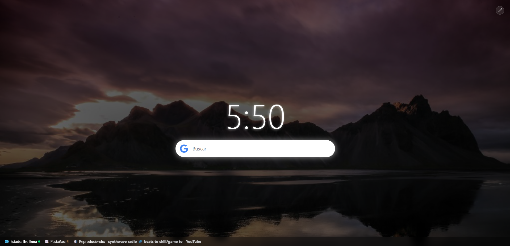

# chrome-new-tab

Una extensión ligera y personalizable que reemplaza la pestaña nueva del navegador con un panel informativo y estético. Muestra el estado de conexión, cantidad de pestañas abiertas y reproducción multimedia. Además, permite configurar tu imagen de fondo para que cada nueva pestaña tenga tu propio estilo.

## 🚀 Características

- 🌐 Estado de conexión (online/offline)
- 🧭 Cantidad total de pestañas abiertas
- 🎵 Detección de pestañas con contenido multimedia
- 🖼️ Imagen de fondo personalizable
- ⚡ Rápido y liviano, construido con Vite + React

## 🛠️ Tecnologías

- [React](https://reactjs.org/)
- [Vite](https://vitejs.dev/)
- [TailwindCSS](https://tailwindcss.com/)
- [Chrome Extensions API](https://developer.chrome.com/docs/extensions/)

## 📦 Instalación

1. Descargá la última versión desde la sección de [Releases](https://github.com/fernandolievano/chrome-new-tab/releases).

2. Extraé el contenido del archivo `.zip`.

3. Cargá la extensión en tu navegador:

   - Abrí `chrome://extensions` o `edge://extensions`
   - Activá **Modo desarrollador**
   - Hacé click en **"Cargar sin comprimir"**
   - Seleccioná la carpeta extraída

✅ ¡Listo! Ahora cada nueva pestaña mostrará tu panel personalizado.

## 📋 Registro de cambios

Ver [CHANGELOG.md](./CHANGELOG.md) para más detalles.

## 🙌 Créditos

Proyecto desarrollado por Fernando Liévano.
Con foco en personalización, simplicidad y rendimiento.
